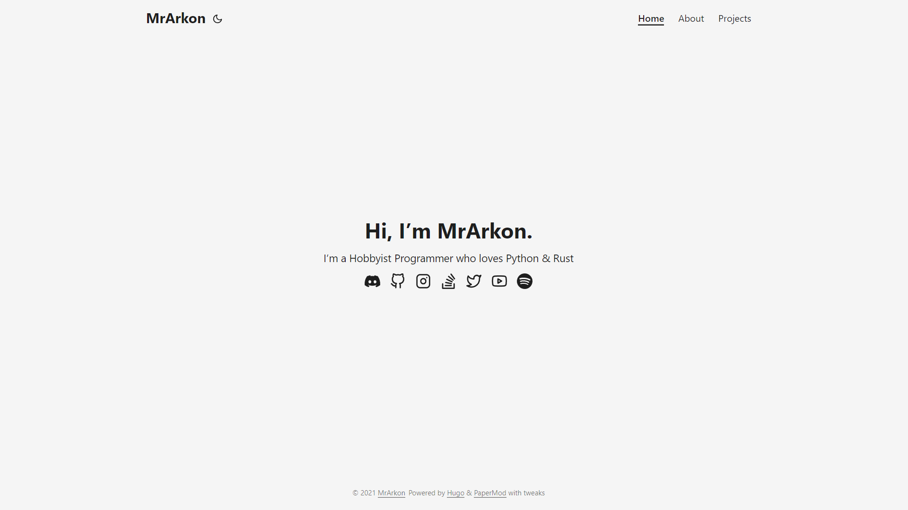
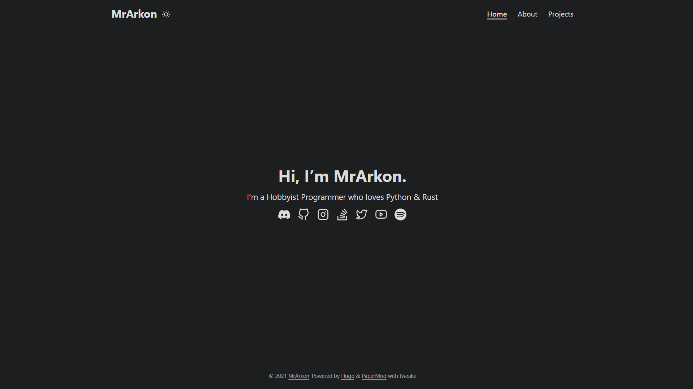

<h1 align="center">
  <a href="https://mrarkon.github.io" target="_blank">mrarkon.github.io</a>
  <br>
</h1>

<h4 align="center">
  The source code for my personal website. Powered by <a href="https://gohugo.io/" target="_blank">Hugo</a> & <a href="https://git.io/hugopapermod" target="_blank">PaperMod</a>.
  <br>
</h4>

<p align="center">
  <a href="https://github.com/MrArkon/mrarkon.github.io/actions/workflows/gh-pages.yml">
    
  </a>
  <a href="https://github.com/MrArkon/mrarkon.github.io/blob/master/LICENSE">
    
  </a>
  <a href="https://github.com/MrArkon/mrarkon.github.io/issues">
    
  </a>
</p>

## Screenshots

| Light Theme | Dark Theme |
| ----------- | ---------- |
|  |  |

## Features
* Dark & Light theme
* Minified CSS & Javascript
* Total Page Size is 9 KB
* [100% LightHouse report](https://lighthouse-dot-webdotdevsite.appspot.com//lh/html?url=https%3A%2F%2Fmrarkon.github.io%2F)

## Installation & Setup
1. Install [Hugo](https://gohugo.io/getting-started/installing)
2. Run a Developement Server

   ```sh
   hugo server -D
   ```

## Building & Running for Production
1. Install [Hugo](https://gohugo.io/getting-started/installing)
2. Build a static website

   ```sh
   hugo build --minify
   ```

## License
This repository is licensed under the GPL 3.0 license. See the file [`LICENSE`](https://github.com/MrArkon/mrarkon.github.io/blob/master/LICENSE) for more information.

----

<h4 align="center">Show some :heart: by starring :star: this repository!</h4>
